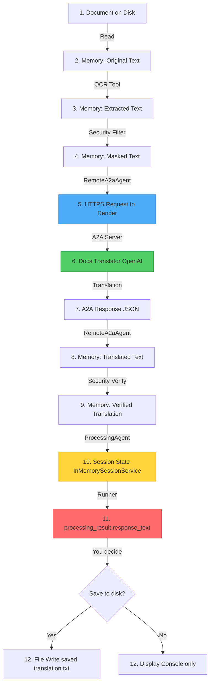

# 🔍 Observability Guide - A2A Data Flow Tracking

Complete guide to understanding where your translated data goes and how to observe the A2A protocol in action.

---

## 🎯 Quick Answers

### Q: Is the A2A server actually calling Docs Translator?

**YES!** Here's the flow:

```
Enterprise (main.py)
    → ProcessingAgent
        → RemoteA2aAgent
            → [HTTPS POST] docs-translator-a2a.onrender.com/invoke
                → A2A Server (FastAPI)
                    → Docs Translator Agent (OpenAI GPT-4o)
                        ← Translated text
                    ← JSON response
            ← Translation result
        ← Sub-agent response
    ← Final output
```

### Q: Where does the translated file go?

**IMPORTANT:** The translation is **NOT saved to disk** by default. It lives in:

1. **In memory** - Python variable: `processing_result.response_text`
2. **Session state** - `InMemorySessionService` (RAM)
3. **Console output** - Printed to terminal
4. **Return value** - Accessible in your code

### Q: How does the enterprise see the translated file?

The enterprise receives the translation in the **agent's response**:

```python
processing_result = await processing_runner.run(prompt)
translated_text = processing_result.response_text

# NOW you can save it, display it, or process it further
print(translated_text)  # Display
```

---

## 🚀 Running the Observability Demo

### Method 1: Detailed Console Logging

```bash
python observability_demo.py
```

**What you'll see:**
- ✅ Complete agent flow visualization
- ✅ A2A call details (URL, payload, response)
- ✅ Data location tracking
- ✅ Security boundary markers
- ✅ Where translation is stored

### Method 2: With Debug Logging

```bash
# In .env file
LOG_LEVEL=DEBUG

python observability_demo.py
```

**Additional output:**
- 🔍 HTTP request/response details
- 🔍 Tool execution timing
- 🔍 Session state changes
- 🔍 Internal agent reasoning

### Method 3: Using ADK Web UI (Interactive Browser Interface) ⭐ RECOMMENDED

The ADK Web UI provides a **visual, interactive interface** to observe the A2A flow in real-time.

#### Setup: Agent Directory Structure

The ADK Web UI requires agents in a specific directory structure:
```
agents_web_ui/
├── intake_agent/
│   ├── __init__.py      # Exports the agent
│   └── agent.py         # Agent definition (LlmAgent instance)
└── processing_agent/
    ├── __init__.py
    └── agent.py
```

**Key requirement:** Each agent must be exposed as a module-level `agent` variable in `agent.py`.

#### Launch Command

```bash
# Start ADK Web UI with A2A support and debug logging
python -m google.adk.cli web --log_level DEBUG --a2a --port 8000 agents_web_ui
```

**Command breakdown:**
- `python -m google.adk.cli web` - Launches ADK's FastAPI web server
- `--log_level DEBUG` - Enables detailed logging (see A2A HTTP calls)
- `--a2a` - Enables A2A protocol endpoint support
- `--port 8000` - Server port (default: 127.0.0.1:8000)
- `agents_web_ui` - Directory containing agent subdirectories

#### Access the Web UI

Open your browser to: **http://localhost:8000**

You'll see:
- 🌐 **Agent selector** - Choose between intake_agent and processing_agent
- 🌐 **Chat interface** - Send prompts and see responses
- 🌐 **Tool call visualization** - Watch OCR, security_filter execute
- 🌐 **Sub-agent calls** - SEE the A2A boundary crossing in real-time
- 🌐 **Session management** - Track conversation state
- 🌐 **Debug console** - View internal logs

#### What You'll Observe

When you interact with **processing_agent**, you'll see:

1. **Tool Call: `ocr_tool`**
   - Extracts text from document
   - Output visible in UI

2. **Tool Call: `security_filter` (stage="pre")**
   - Masks PII before vendor
   - Shows [PERSON_1], [SSN_1] replacements

3. **🔥 Sub-Agent Call: `docs_translator_vendor`** ← **A2A BOUNDARY!**
   - This is the RemoteA2aAgent
   - Calls: https://docs-translator-a2a.onrender.com/invoke
   - You'll see the request/response in the UI

4. **Tool Call: `security_filter` (stage="post")**
   - Verifies vendor response
   - Checks for PII leakage

5. **Final Response**
   - English translation returned to enterprise
   - Displayed in chat interface

#### Verify A2A Connection

In the terminal running the web server, you'll see:
```
2025-11-20 23:38:46,240 - urllib3.connectionpool - DEBUG - Starting new HTTPS connection (1): docs-translator-a2a.onrender.com:443
2025-11-20 23:38:46,745 - urllib3.connectionpool - DEBUG - https://docs-translator-a2a.onrender.com:443 "GET /.well-known/agent-card.json HTTP/1.1" 200 937
```

This proves the A2A connection is live!

#### Stop the Web UI

Press `Ctrl+C` in the terminal running the server.

---

## 📊 Understanding the Data Flow

### Step-by-Step: Where Your Translation Goes



### Key Locations Explained

| Stage | Location | Persistence | Access |
|-------|----------|-------------|--------|
| **Original document** | `samples/sample_document.txt` | Disk | Always available |
| **Extracted text** | Python variable (OCR output) | Memory | Lost after run |
| **Masked text** | Python variable (security filter) | Memory | Lost after run |
| **A2A request** | Network (HTTPS body) | Transient | Not stored |
| **Translation** | A2A response JSON | Memory | Lost after run |
| **Final output** | `processing_result.response_text` | Memory | **You can save it!** |
| **Session state** | `InMemorySessionService` | RAM | Available during run |

---

## 🔍 Observing the A2A Protocol

### 1. Watch HTTP Traffic

**Browser DevTools:**

```bash
# Open Chrome DevTools
# Go to Network tab
# Run the demo
# Look for requests to docs-translator-a2a.onrender.com
```

**cURL Test (Manual):**

```bash
# Fetch Agent Card
curl https://docs-translator-a2a.onrender.com/.well-known/agent-card.json

# Test translation
curl -X POST https://docs-translator-a2a.onrender.com/invoke \
  -H "Content-Type: application/json" \
  -d '{
    "capability": "translate_document",
    "parameters": {
      "text": "Hola mundo",
      "source_language": "es",
      "target_language": "en"
    }
  }'
```

### 2. Check Render Logs

```bash
# Go to Render dashboard
https://dashboard.render.com

# Select: docs-translator-a2a service
# Click: Logs tab
# Watch in real-time while running demo
```

**What to look for:**
- ✅ Incoming POST /invoke requests
- ✅ Translation agent execution
- ✅ OpenAI API calls
- ✅ Response generation
- ✅ Any errors

### 3. Enable ADK Tracing

Add this to your demo script:

```python
import logging

# Enable ADK internal logging
logging.getLogger("google.adk").setLevel(logging.DEBUG)
logging.getLogger("a2a").setLevel(logging.DEBUG)
```

---

## 💾 Saving the Translation (How Enterprise Gets the File)

### Option 1: Save to File Automatically

Add this to `main.py` or `observability_demo.py`:

```python
# After processing_result = await processing_runner.run(prompt)

# Extract translated text
translated_text = processing_result.response_text

# Save to file
output_file = Path("output") / "translated_document.txt"
output_file.parent.mkdir(exist_ok=True)
output_file.write_text(translated_text, encoding="utf-8")

print(f"✅ Translation saved to: {output_file}")
```

### Option 2: Create a Tool for Saving

Create `tools/save_tool.py`:

```python
from pathlib import Path
from datetime import datetime

def save_translation(
    text: str,
    output_dir: str = "output",
    prefix: str = "translated"
) -> dict:
    """
    Save translated text to file.

    Args:
        text: Translated text to save
        output_dir: Output directory (default: output)
        prefix: Filename prefix (default: translated)

    Returns:
        dict: {status, file_path, size_bytes}
    """
    output_path = Path(output_dir)
    output_path.mkdir(exist_ok=True)

    timestamp = datetime.now().strftime("%Y%m%d_%H%M%S")
    filename = f"{prefix}_{timestamp}.txt"
    file_path = output_path / filename

    file_path.write_text(text, encoding="utf-8")

    return {
        "status": "success",
        "file_path": str(file_path),
        "size_bytes": file_path.stat().st_size
    }
```

Then add to ProcessingAgent:

```python
from tools.save_tool import save_translation

agent = LlmAgent(
    # ...
    tools=[ocr_tool, security_filter, save_translation],
    # ...
)
```

### Option 3: Use Database Session Service

For persistent storage:

```python
from google.adk.sessions import DatabaseSessionService

# Instead of InMemorySessionService
session_service = DatabaseSessionService(
    database_url="sqlite:///sessions.db"
)

# Sessions persist to disk!
# Translation is in session history
```

---

## 🎯 Testing Observability

### Test 1: Verify A2A is Working

```bash
python observability_demo.py 2>&1 | grep -A5 "A2A HTTPS"
```

**Expected output:**
```
STEP 1: A2A VENDOR CONNECTION
✅ VENDOR CONNECTION ESTABLISHED
   → Agent Card URL: https://docs-translator-a2a.onrender.com/.well-known/agent-card.json
   → Vendor Name: docs_translator_vendor
   → Protocol: A2A over HTTPS
```

### Test 2: Check Translation Response

```bash
python observability_demo.py 2>&1 | grep -A10 "ProcessingAgent Final Response"
```

**Expected:** You should see the translated English text.

### Test 3: Verify Data Not Saved to Disk

```bash
# Run demo
python observability_demo.py

# Check for any new files
ls -la output/ 2>/dev/null || echo "No output directory (expected)"
```

**Expected:** No new files created (unless you added save logic).

---

## 📈 Advanced Observability

### OpenTelemetry Integration

For production, add tracing:

```python
from opentelemetry import trace
from opentelemetry.sdk.trace import TracerProvider
from opentelemetry.sdk.trace.export import ConsoleSpanExporter, SimpleSpanProcessor

# Set up tracer
trace.set_tracer_provider(TracerProvider())
tracer = trace.get_tracer(__name__)

# Add exporter
trace.get_tracer_provider().add_span_processor(
    SimpleSpanProcessor(ConsoleSpanExporter())
)

# Instrument agent calls
with tracer.start_as_current_span("document_processing"):
    processing_result = await processing_runner.run(prompt)
```

### Render Metrics

Monitor your A2A server:

```bash
# Render dashboard metrics
https://dashboard.render.com

# Select: docs-translator-a2a
# View: Metrics tab

# Key metrics:
- Request rate (req/min)
- Response time (ms)
- Error rate (%)
- Memory usage (MB)
```

---

## 🐛 Troubleshooting Observability

### Issue: Can't see A2A calls

**Solution:**

```python
import logging
import httpx

# Enable httpx logging (used by RemoteA2aAgent)
logging.getLogger("httpx").setLevel(logging.DEBUG)
```

### Issue: Don't know where translation is stored

**Solution:**

```python
# After processing
print("\n=== TRANSLATION LOCATION ===")
print(f"Type: {type(processing_result)}")
print(f"Response text length: {len(processing_result.response_text)}")
print(f"First 200 chars: {processing_result.response_text[:200]}")
```

### Issue: Want to inspect session state

**Solution:**

```python
# After processing
print("\n=== SESSION STATE ===")
# Session service stores conversation history
# Access it through runner or session_service
```

---

## 📚 Key Takeaways

1. **Translation is in memory by default**
   - Not saved to disk automatically
   - Enterprise receives it in `processing_result.response_text`
   - You must explicitly save if needed

2. **A2A server DOES call Docs Translator**
   - HTTPS POST to /invoke endpoint
   - JSON payload with masked text
   - JSON response with translation

3. **Data flow is traceable**
   - Console logging shows each step
   - Render logs show server-side
   - ADK Web UI visualizes flow (if available)

4. **Security boundaries are clear**
   - PII masked before A2A
   - Vendor never sees raw data
   - Response verified after A2A

---

## 🚀 Next Steps

1. **Run the observability demo:**
   ```bash
   python observability_demo.py
   ```

2. **Check Render logs in real-time:**
   - Go to: https://dashboard.render.com
   - Select: docs-translator-a2a
   - Watch logs during demo run

3. **Add file saving if needed:**
   - Use Option 1, 2, or 3 from "Saving the Translation" section

4. **Explore ADK Web UI:**
   - Check if available: `python -m google.adk.web --help`
   - Start server and visualize agent flow

---

**Questions?** Run `python observability_demo.py` for a complete walkthrough!
