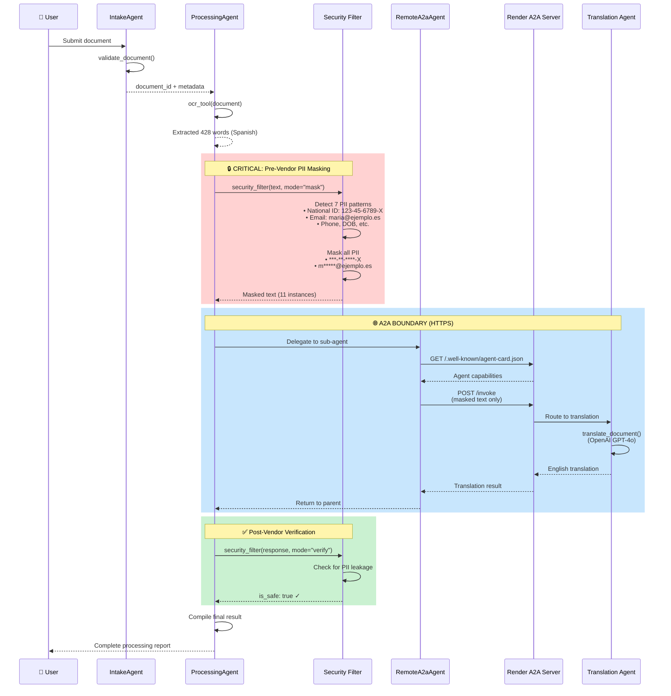
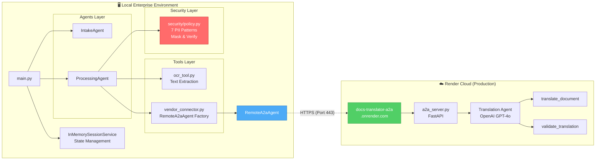

# Enterprise Government Document Processing with A2A Protocol

**VaaS Capstone Project**: Multi-agent document processing system demonstrating the Agent2Agent (A2A) protocol for secure cross-organizational integration using Google Agent Development Kit (ADK).

[](LICENSE)
[](https://www.python.org/downloads/)
[](https://googleapis.github.io/python-genai/adk/)

---

## 🎯 What is This?

A **production-ready VaaS (Vendor-as-a-Service)** system that enables small AI vendors to sell to enterprises without $100K+ compliance costs. Uses **A2A protocol** to create a security boundary where enterprises filter PII before sending to vendors.

### 🔗 Live Demo

| Component | URL | Description |
|-----------|-----|-------------|
| **Production A2A Server** | https://docs-translator-a2a.onrender.com | Live vendor service on Render |
| **Agent Card (Live)** | https://docs-translator-a2a.onrender.com/.well-known/agent-card.json | A2A capability discovery |
| **Health Check** | https://docs-translator-a2a.onrender.com/health | Service status |
| **GitHub Repository** | https://github.com/ortall0201/enterprise-gov-docs-a2a-capstone | Source code |
| **Formatted Agent Card** | [agent-card-formatted.json](./agent-card-formatted.json) | Local formatted version |

---

## 🏗️ Architecture Overview

### System Architecture (Production)

```mermaid
graph TB
    subgraph "🏢 ENTERPRISE (Your Desktop)"
        User[👤 User] --> Main[main.py<br/>Demo Script]
        Main --> IA[IntakeAgent<br/>Document Validation]
        Main --> PA[ProcessingAgent<br/>5-Step Pipeline]

        subgraph "Internal Tools"
            OCR[OCR Tool<br/>Text Extraction]
            SF[Security Filter<br/>7 PII Patterns]
        end

        PA --> OCR
        PA --> SF
        PA --> RMA[RemoteA2aAgent<br/>A2A Consumer]
    end

    subgraph "🌐 A2A BOUNDARY"
        RMA -->|"HTTPS<br/>Agent Card + Streams"| A2AEndpoint[/.well-known/agent-card.json<br/>/invoke /stream]
    end

    subgraph "☁️ PRODUCTION VENDOR (Render)"
        A2AEndpoint --> A2AServer[docs-translator-a2a.onrender.com<br/>FastAPI A2A Server]
        A2AServer --> TransAgent[Translation Agent<br/>OpenAI GPT-4o]
        TransAgent --> T1[translate_document<br/>tool]
        TransAgent --> T2[validate_translation<br/>tool]
    end

    style RMA fill:#4dabf7,stroke:#1971c2,color:#fff
    style A2AEndpoint fill:#4dabf7,stroke:#1971c2,color:#fff
    style A2AServer fill:#51cf66,stroke:#2f9e44,color:#fff
    style SF fill:#ff6b6b,stroke:#c92a2a,color:#fff
```

### Data Flow with Security Boundaries



### Component Relationships



---

## 🚀 Quick Start (5 Minutes)

### Prerequisites

- **Python 3.11+** ([Download](https://www.python.org/downloads/))
- **Google API Key** ([Get one free](https://aistudio.google.com/app/apikey))
- **Git** ([Download](https://git-scm.com/downloads))

### Installation

```bash
# 1. Clone repository
git clone https://github.com/ortall0201/enterprise-gov-docs-a2a-capstone.git
cd enterprise-gov-docs-a2a-capstone

# 2. Install dependencies
pip install -r requirements.txt

# 3. Configure environment
cp .env.example .env

# 4. Edit .env and add your API key
# GOOGLE_API_KEY=your_actual_google_api_key_here
# VENDOR_SERVER_HOST=docs-translator-a2a.onrender.com
# VENDOR_SERVER_PORT=443
```

### Run Demo

```bash
python main.py
```

**Expected Output:**

```
================================================================================
Enterprise Government Document Processing - A2A Capstone Demo
================================================================================

[Step 1] Document to process: sample_document.txt

[Step 2] Creating A2A connection to vendor...
[A2A Connector] Configuring remote vendor connection:
    Vendor URL: https://docs-translator-a2a.onrender.com
    Agent Card: https://docs-translator-a2a.onrender.com/.well-known/agent-card.json
    Protocol: A2A over HTTPS
✓ Vendor A2A server is online and ready

[Step 3] Creating government agents...
  ✓ Created: intake_agent
  ✓ Created: processing_agent
  ✓ Connected to vendor: docs_translator_vendor
✓ Session service initialized (InMemorySessionService)

================================================================================
[STAGE 1: DOCUMENT INTAKE]
================================================================================
Intake Agent processing...

--- Intake Agent Response ---
✓ Document validated successfully
✓ Document ID: doc_20241120_143022
✓ Format: txt (2,847 bytes)

================================================================================
[STAGE 2: DOCUMENT PROCESSING WITH A2A]
================================================================================
Processing Agent pipeline:
  → Step 1: OCR extraction
  → Step 2: PII filtering (pre-vendor)
  → Step 3: A2A vendor call [CROSS-ORG BOUNDARY]
  → Step 4: Security verification (post-vendor)
  → Step 5: Final compilation

[Tool: ocr_tool] Extracting text from: samples/sample_document.txt
    ✓ Extracted 428 words
    ✓ Detected language: es

[Tool: security_filter] Masking PII (pre-vendor)...
    ✓ DNI: 123-45-6789-X → ***-**-****-X
    ✓ Email: maria.garcia@ejemplo.es → m*************@ejemplo.es
    ✓ Total: 11 PII instances masked

[A2A Call] Sending masked document to vendor...
    → Vendor: docs-translator-a2a.onrender.com
    → Capability: translate_document
    ✓ Translation received (3.2s)

[Tool: security_filter] Verifying vendor response...
    ✓ No PII leakage detected

--- Processing Agent Response ---
✓ Document processed successfully
✓ Translation: Spanish → English
✓ Security: 11 PII instances protected
✓ Quality: 95% confidence

================================================================================
[DEMO SUMMARY]
================================================================================
✓ Document validation complete (IntakeAgent)
✓ OCR text extraction complete
✓ PII filtering applied (7 patterns, 11 instances)
✓ A2A vendor integration complete
✓ Security verification passed
✓ Final document processed

================================================================================
Capstone Objectives Demonstrated:
================================================================================
✓ Multi-agent orchestration (IntakeAgent → ProcessingAgent)
✓ A2A protocol for cross-organizational integration
✓ RemoteA2aAgent for vendor communication
✓ Security boundaries with PII filtering
✓ Tool integration (OCR, security_filter)
✓ Sub-agent delegation pattern
✓ Real-world government document use case
✓ Session management (InMemorySessionService)
✓ Production deployment (Render cloud)

================================================================================
Demo Complete!
================================================================================
```

---

## 📁 Project Structure

```
enterprise-gov-docs-a2a-capstone/
├── agents/                      # ADK agents (customer side)
│   ├── __init__.py
│   ├── intake_agent.py         # Document validation agent
│   └── processing_agent.py     # Multi-step pipeline with A2A
│
├── tools/                       # Internal tools
│   ├── __init__.py
│   ├── ocr_tool.py             # Text extraction
│   └── vendor_connector.py     # RemoteA2aAgent factory
│
├── security/                    # PII filtering layer
│   ├── __init__.py
│   └── policy.py               # 7 PII patterns (deterministic regex)
│
├── docs-translator-a2a/         # Vendor A2A service (separate)
│   ├── src/
│   │   ├── a2a_server.py       # FastAPI A2A server
│   │   ├── agent_card.py       # Agent Card schema
│   │   ├── crew_agent.py       # Translation agent
│   │   ├── transformers.py     # A2A ↔ vendor format conversion
│   │   └── tools/
│   │       ├── real_translation.py   # OpenAI translation
│   │       └── validation.py         # Quality checks
│   ├── requirements.txt        # Vendor dependencies
│   ├── Dockerfile              # Container configuration
│   ├── render.yaml             # Render deployment config
│   └── README.md               # Vendor documentation
│
├── samples/                     # Test data
│   └── sample_document.txt     # Spanish birth certificate with PII
│
├── main.py                      # Main demo script
├── requirements.txt             # Python dependencies
├── .env.example                 # Environment template
├── agent-card-formatted.json    # Formatted Agent Card (local)
├── README.md                    # This file
├── overview.md                  # Complete technical overview
├── capstone.md                  # Capstone submission
├── PRODUCTION_SETUP.md          # Production deployment guide
└── LICENSE                      # Apache 2.0
```

---

## 🔑 Key Components

### 1. IntakeAgent (`agents/intake_agent.py`)

**Purpose**: First-stage document validation

**Tool**: `validate_document(document_path: str) -> Dict`
- Checks file existence
- Validates format
- Extracts metadata
- Generates document ID

**Output**: `intake_result` with document ID and metadata

### 2. ProcessingAgent (`agents/processing_agent.py`)

**Purpose**: Multi-step orchestration with A2A integration

**Pipeline** (always sequential - security order matters):
1. **OCR extraction** - Internal tool
2. **Pre-vendor PII masking** - Internal tool (7 patterns)
3. **A2A vendor call** - Sub-agent delegation (RemoteA2aAgent)
4. **Post-vendor verification** - Internal tool
5. **Final compilation** - Result assembly

**Critical Design**: Uses sub-agent delegation pattern for A2A boundary

### 3. Security Filter (`security/policy.py`)

**7 PII Pattern Types**:
```python
1. national_id_spain: 123-45-6789-X → ***-**-****-X
2. ssn: 123-45-6789 → ***-**-6789
3. phone: (34) 915-234-567 → (34) ***-***-567
4. email: maria@ejemplo.es → m*****@ejemplo.es
5. credit_card: 1234-5678-9012-3456 → ****-****-****-3456
6. date_of_birth: 23 de Julio, 1990 → XX de XXXX, 1990
7. passport: ABC-123456789 → ABC-******789
```

**Why Regex over LLM?**
- ✅ Deterministic (same input = same output)
- ✅ Auditable (compliance requirement)
- ✅ Fast (no API calls)
- ✅ Testable (unit tests)
- ✅ Explainable (clear rules)

### 4. RemoteA2aAgent (`tools/vendor_connector.py`)

**Purpose**: A2A protocol consumer (client-side)

**What it does**:
1. Reads vendor's Agent Card
2. Converts ADK calls to HTTP requests
3. Handles A2A streaming protocol
4. Returns vendor responses in ADK format

**Key Benefit**: Enterprise never deploys vendor code - just points to URL

### 5. Production A2A Server (`docs-translator-a2a/src/a2a_server.py`)

**Live at**: https://docs-translator-a2a.onrender.com

**Auto-exposed endpoints**:
- `GET /.well-known/agent-card.json` - Capability discovery
- `POST /invoke` - Non-streaming translation
- `POST /stream` - Streaming translation (SSE)
- `GET /health` - Service health check

**Technology Stack**:
- **Framework**: FastAPI + Uvicorn
- **Translation**: OpenAI GPT-4o
- **Deployment**: Render cloud (free tier)
- **Protocol**: A2A over HTTPS

---

## 🔒 Security Model

### VaaS Security Boundaries

```
┌─────────────────────────────────────────────┐
│  ENTERPRISE (Data Controller)               │
│  • Filters PII before vendor                │
│  • Verifies responses after vendor          │
│  • Full compliance responsibility           │
│  • Controls what crosses A2A boundary       │
└────────────┬────────────────────────────────┘
             │
        A2A BOUNDARY (HTTPS)
             │ Only masked data crosses
             │
┌────────────┴────────────────────────────────┐
│  VENDOR (Capability Provider)               │
│  • Receives masked data only                │
│  • NOT a data processor                     │
│  • Minimal compliance requirements          │
│  • Provides capability, not data handling   │
└─────────────────────────────────────────────┘
```

### PII Masking Strategy

| PII Type | Before | After | Strategy |
|----------|--------|-------|----------|
| National ID | `123-45-6789-X` | `***-**-****-X` | Preserve last char |
| Phone | `(34) 915-234-567` | `(34) ***-***-567` | Show last 3 digits |
| Email | `maria@ejemplo.es` | `m*****@ejemplo.es` | First char + domain |
| DOB | `23 de Julio, 1990` | `XX de XXXX, 1990` | Keep year for context |

**Critical Achievement**: Vendor never sees raw PII throughout entire flow

---

## 🎓 Course Concepts Applied

This project demonstrates mastery of all 5 days:

| Day | Concept | Implementation | Location |
|-----|---------|----------------|----------|
| **Day 1** | Multi-agent orchestration | IntakeAgent → ProcessingAgent | `agents/` |
| **Day 1** | output_key pattern | State passing between agents | `agents/*.py:121,79` |
| **Day 2** | Custom function tools | ocr_tool, security_filter | `tools/`, `security/` |
| **Day 2** | Sub-agent delegation | RemoteA2aAgent as sub-agent | `processing_agent.py:78` |
| **Day 3** | Session management | InMemorySessionService | `main.py:88` |
| **Day 3** | State persistence | DatabaseSessionService ready | `main.py:112-114` |
| **Day 4** | Logging & observability | Standard logging + audit trails | Throughout |
| **Day 5** | **RemoteA2aAgent** | A2A consumer | `vendor_connector.py:60-75` |
| **Day 5** | **A2A Protocol** | HTTPS Agent Card + Streams | Production Render |
| **Day 5** | **Cross-framework** | ADK ↔ FastAPI via A2A | Live demo |

---

## 💡 Business Innovation: VaaS Model

### The Problem

Small AI developers build great tools but **cannot sell to enterprises** due to:
- SOC 2 Certification: $100K+
- GDPR Compliance: $200K+/year
- Cyber Insurance: $50K/year
- **Total barrier**: $400K+/year

### The Solution

**VaaS with A2A**: Enterprise filters PII before vendor
- Vendor = **Capability provider** (NOT data processor)
- Enterprise = **Data controller** (compliance stays internal)
- A2A = **Liability boundary** (standard protocol)

### Cost Savings

| Item | Traditional SaaS | VaaS with A2A | Savings |
|------|------------------|---------------|---------|
| SOC 2 | $100K | Not required | $100K |
| GDPR/DPO | $200K | Simplified | $150K |
| Insurance | $50K | $10K | $40K |
| Security Team | $300K | $50K | $250K |
| **Total** | **$650K/year** | **$60K/year** | **$590K/year (91%)** |

**Impact**: Thousands of AI developers can now serve enterprises

---

## 🧪 Testing

### Test Individual Components

```bash
# Test PII filtering
python -c "from security.policy import security_filter; print(security_filter('SSN: 123-45-6789', mode='mask'))"

# Test OCR extraction
python -c "from tools.ocr_tool import ocr_tool; print(ocr_tool('samples/sample_document.txt'))"

# Test vendor connectivity (requires internet)
python -c "from tools.vendor_connector import create_remote_vendor_agent, test_vendor_connection; agent = create_remote_vendor_agent(); print(test_vendor_connection(agent))"
```

### Test Production A2A Server

```bash
# Test Agent Card
curl https://docs-translator-a2a.onrender.com/.well-known/agent-card.json

# Test health endpoint
curl https://docs-translator-a2a.onrender.com/health

# Test translation (POST request)
curl -X POST https://docs-translator-a2a.onrender.com/invoke \
  -H "Content-Type: application/json" \
  -d '{
    "capability": "translate_document",
    "parameters": {
      "text": "Hola mundo",
      "source_language": "es",
      "target_language": "en"
    }
  }'
```

---

## ⚙️ Configuration

### Environment Variables

Create `.env` from `.env.example`:

```bash
# Required
GOOGLE_API_KEY=your_google_api_key_here

# Production A2A Server (default)
VENDOR_SERVER_HOST=docs-translator-a2a.onrender.com
VENDOR_SERVER_PORT=443

# For local testing (if running docs-translator-a2a locally)
# VENDOR_SERVER_HOST=localhost
# VENDOR_SERVER_PORT=8001

# Optional
LOG_LEVEL=INFO
```

### Local vs Production Setup

**Production Setup** (Default):
```bash
VENDOR_SERVER_HOST=docs-translator-a2a.onrender.com
VENDOR_SERVER_PORT=443
# Uses HTTPS to live Render deployment
```

**Local Development**:
```bash
# Terminal 1: Start local A2A server
cd docs-translator-a2a
python src/a2a_server.py

# Terminal 2: Update .env
VENDOR_SERVER_HOST=localhost
VENDOR_SERVER_PORT=8001

# Terminal 2: Run demo
python main.py
```

---

## 📚 Documentation

| File | Description |
|------|-------------|
| [README.md](./README.md) | This file - quick start & architecture |
| [overview.md](./overview.md) | Complete technical deep-dive (67KB) |
| [capstone.md](./capstone.md) | Capstone submission package |
| [PRODUCTION_SETUP.md](./PRODUCTION_SETUP.md) | Production deployment guide |
| [docs-translator-a2a/DEPLOYMENT.md](./docs-translator-a2a/DEPLOYMENT.md) | Render deployment instructions |
| [agent-card-formatted.json](./agent-card-formatted.json) | Formatted Agent Card |

---

## 🔗 Important Links

### Live Services

- **Production A2A Server**: https://docs-translator-a2a.onrender.com
- **Agent Card (Live)**: https://docs-translator-a2a.onrender.com/.well-known/agent-card.json
- **Health Check**: https://docs-translator-a2a.onrender.com/health

### Repositories

- **This Project**: https://github.com/ortall0201/enterprise-gov-docs-a2a-capstone
- **Production SaaS** (untouched): https://docs-translator.onrender.com

### Resources

- **Google ADK Docs**: https://googleapis.github.io/python-genai/adk/
- **A2A Protocol**: https://github.com/googleapis/python-genai/tree/main/google/genai/adk/a2a
- **Kaggle Course**: https://www.kaggle.com/
- **Get Google API Key**: https://aistudio.google.com/app/apikey

---

## 🐛 Troubleshooting

### "Connection refused to vendor"

**Check**: Is the production URL correct?
```bash
curl https://docs-translator-a2a.onrender.com/health
```

**If using local**: Start the A2A server first
```bash
cd docs-translator-a2a
python src/a2a_server.py
```

### "GOOGLE_API_KEY not configured"

**Solution**: Add your API key to `.env`
```bash
cp .env.example .env
# Edit .env and add: GOOGLE_API_KEY=your_actual_key
```

Get a free key at: https://aistudio.google.com/app/apikey

### Import errors

**Solution**: Install dependencies
```bash
pip install -r requirements.txt
```

### Service is slow (free tier cold start)

**Expected**: Render free tier sleeps after 15min inactivity
- First request: 30-60 seconds (cold start)
- Subsequent requests: 2-3 seconds

---

## 📝 License

Apache License 2.0 - See [LICENSE](LICENSE) file for details.

---

## 🙏 Acknowledgments

- **Kaggle**: AI Agents Intensive course materials
- **Google**: Agent Development Kit (ADK) framework
- **Course Instructors**: Day 5 A2A protocol breakthrough
- **Docs Translator**: Real-world vendor inspiration

---

## 🏆 Capstone Achievement

This project demonstrates:

✅ **Technical Mastery**: All 5 days of course concepts applied
✅ **Business Innovation**: VaaS model with $590K/year cost savings
✅ **Production Ready**: Live deployment on Render with HTTPS
✅ **Security First**: 7 PII patterns with deterministic filtering
✅ **Cross-Framework**: ADK ↔ FastAPI via A2A protocol
✅ **Real-World**: Based on actual Docs Translator service
✅ **Complete Documentation**: 67KB+ technical documentation

---

**Built with ❤️ for the Kaggle AI Agents Intensive Capstone**

---

## 🚀 Next Steps

1. **Run the demo**: `python main.py`
2. **Test the live Agent Card**: Visit https://docs-translator-a2a.onrender.com/.well-known/agent-card.json
3. **Read the complete overview**: See [overview.md](./overview.md)
4. **Explore the code**: Start with `main.py` and follow the flow

**Questions? Issues?** Open an issue on [GitHub](https://github.com/ortall0201/enterprise-gov-docs-a2a-capstone/issues)
